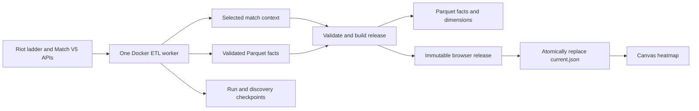

# ProLeague Heatmap

Explore where NA Challenger and Grandmaster solo queue players get kills and die on Summoner’s Rift. Subject, opponent, and match-context filters drive four views: Deaths, Kills, Danger, and Opportunity.

The source is **solo queue**, not professional tournament play. A ladder player’s appearance seeds a match; it does not establish the rank of every participant at match time. Not endorsed by Riot Games.

**Live application:** [https://d2g2939h9izjje.cloudfront.net](https://d2g2939h9izjje.cloudfront.net)

## Run locally

Requires Python 3.12+, Node 22+, and a Riot development API key for collection.

```sh
make setup
# Set RIOT_API_KEY in .env; .env.example shows the supported variables.
make serve
```

Open http://localhost:8000. The application starts empty when no real release exists. `make demo` is an alias for this same real-data application and does not generate fixtures.

The **Game data** section has one button, **Update game data**. It refreshes the configured ladder histories and processes the entire deduplicated universe, so it has no target count: it reads every ladder player’s recent history first, then fetches the games it has not already collected. The status line reports discovered candidates during that first stage, because new games necessarily stay at zero until discovery finishes.

Cached, rejected, and failed games do not count as new; eligible games with zero kill events do count. Concurrent clicks show the active run.

The bounded `smoke` (50 games) and `small` (250 games) modes still exist behind the API and the CLI for quick verification; they are simply no longer exposed as buttons. A bounded run that cannot be satisfied from available histories reports the actual count and pauses instead of claiming completion.

Equivalent commands are `make smoke`, `make small`, `make full`, and `make status`. Resume a paused run’s original quota with:

```sh
PYTHONPATH=src .venv/bin/python -m proleague.pipeline --resume RUN_UUID --local
```

`config.yaml` selects routing, tiers, patch/time bounds, and the latest-history depth per player. Full refresh uses that configured window, not all games ever played. The bounded `smoke` and `small` modes discover incrementally, so collection starts without walking the entire ladder first. Every sample depends on discovered histories and is not a random sample of all ranked play.

The local key is loaded from `.env` without overriding an explicitly injected environment variable. Refreshing `.env` works for the next worker. If you exported an old key in your shell, update or unset that override too.

## ETL and retained data



Full ladder, match, and timeline responses exist only in worker memory. The collector transforms each timeline before persistence and retains selected match dimensions, kill/death facts, reconciliation metadata, and retry checkpoints. ETL reduces retained data and makes the intended analytical schema explicit. The tradeoff is that features needing discarded fields require another API fetch; schema changes cannot always be reconstructed from stored data.

A canonical match is stored under `curated/v1/<matchId>/` as `context.json`, `facts.parquet`, validation metadata, and a `complete.json` marker written last. Timeline failures reuse saved context. Completed games are deduplicated by match ID; events use match ID plus source frame/event indices. Incomplete objects are ignored by publication.

The builder checks input hashes, event identities, match counts, participant references, and join cardinality. It writes relational snapshots for `fact_kill`, `dim_match`, and `dim_participant`, then immutable browser assets. Release identity includes both input inventory and a format version. Conflicting immutable writes fail. Only after successful validation and upload does `data/current.json` point at the release.

The browser checks Riot provenance in both the pointer and manifest. It retains a previously loaded valid release when a new download fails. Missing, incomplete, rejected, or zero-event data produces honest empty/error states. **Synthetic data is never served or deployed.** Invented test inputs live only in temporary test directories. The previous synthetic web bundle was moved into the ignored `data/quarantine/` directory.

## Heatmap semantics

| View | Meaning |
| --- | --- |
| Deaths | Distribution of deaths whose victim matches the subject and killer matches the opponent filters. |
| Kills | Distribution of kills whose killer matches the subject and victim matches the opponent filters. |
| Danger | Smoothed death share: `(D + 5) / (D + K + 10)`. |
| Opportunity | `1 - Danger`, using the same eligible events. |

Danger and Opportunity are diverging layers: 0.5 stays pinned to the ramp’s midpoint, and the span is stretched to the range actually present, because a real danger ratio rarely leaves 0.4–0.6 and the full 0–1 ramp would render it as one flat grey. The legend prints the resulting endpoints.

The ratio is descriptive, not a causal win probability. When filters include both sides of every champion kill, kills and deaths balance and the unsmoothed ratio is 0.5. Select a meaningful subject cohort to compare its outcomes.

Events are binned where they happened, on the side they happened. Summoner’s Rift is rotationally similar but not symmetric — lane geometry, camps, and brush differ between sides — so blue and red are never folded together. Coordinates normalize the asymmetric map bounds and flip Y once for the canvas. Team gold is blue minus red; lane gold is relative to the matching actor’s lane opponent. Missing values remain missing. Executions have a victim but no champion killer.

Zone totals come from exact selected events, independent of display grid resolution. Sparse ratio cells are suppressed, and thin slices use coarser grids. **Smooth** applies a separable Gaussian to the death and kill grids before anything is derived from them, so Danger and Opportunity are formed from the smoothed counts rather than by blurring a ratio, which would weight a cell of one event like a cell of fifty. Player selections and shared links use stable PUUID identity, while names are display labels: the in-game Riot ID name leads and its `#tagline` trails it dimmed, kept because a small share of ladder names collide. Advanced columns load lazily before applying filters that need them.

The browser receives aligned typed-array columns with JSON dictionaries instead of parsing full API payloads. Canonical Parquet keeps stable source identities; compact release-specific dictionary indices support the browser’s scan. Champion names and map artwork come from pinned Data Dragon version 16.17.1.

## AWS and Docker

Terraform creates private data/site S3 buckets, CloudFront with origin access control, ECR, a Fargate task definition, DynamoDB run state, CloudWatch logs, an API Gateway HTTP API with a Lambda controller, and Athena/Glue tables. The initial worker is ARM64 with 0.5 vCPU and 2 GiB memory. It runs only for a manual collection; there is no scheduled collection.

The deployed API has no sign-in requirement, as intended for this proof of concept. It accepts only predefined modes, throttles requests, remembers request UUIDs, and reserves one active worker. ECS launch parameters and the idempotency token are durable before launch. An uncertain launch retains ownership while being reconciled. Task-stop events and status checks recover abandoned runs without releasing another run’s lock.

| Interface | Contract |
| --- | --- |
| `POST /api/runs` | `{ "mode": "smoke", "requestId": "UUID" }` |
| `GET /api/status` | `{ "run": { "run_id", "mode", "status", "stage", "new_games", "target", ... }, "dataset": { "dataset_id", "count" } }` |
| `data/current.json` | `{ "dataset_id", "base", "source_kind": "riot" }` |

The local development server implements the same application API. In AWS, Lambda validates the key before starting Fargate. Missing or rejected credentials return `auth_required` without a task launch. A worker encountering expiry checkpoints, exits, and requires a refreshed key plus a manual trigger. Run statuses are `starting`, `running`, `succeeded`, `paused`, `auth_required`, and `failed`.

The Riot key is an SSM SecureString. Terraform handles only its name and ARN. `scripts/aws_key.py` validates the local value and uploads it without printing it; neither Terraform state, the image, the site, nor API responses contain the key.

```sh
# Optional local Docker workflow
# On this Mac: Colima plus Docker Compose and buildx are installed.
docker compose up --build preview
# One standalone local collection:
docker compose --profile collect run --rm collector

# AWS deployment: profile default, region us-east-1
.venv/bin/python scripts/aws_deploy.py bootstrap
.venv/bin/python scripts/aws_deploy.py init
.venv/bin/python scripts/aws_deploy.py plan
.venv/bin/python scripts/aws_deploy.py apply
.venv/bin/python scripts/aws_deploy.py image --image-tag build-UNIQUE_TAG
.venv/bin/python scripts/aws_deploy.py apply --image-tag build-UNIQUE_TAG
.venv/bin/python scripts/aws_key.py
.venv/bin/python scripts/aws_deploy.py site
.venv/bin/python scripts/aws_deploy.py status
```

Deployment helpers retain Terraform’s interactive approval unless `--auto-approve` is supplied. ECR tags are immutable: use a new tag for changed code. Site upload uses an extension allowlist including ES modules and excludes local data, dotfiles, and symlinks. Dataset publication belongs exclusively to the worker.

Athena tables use injected `dataset_id` partition projection. Every query must select a release explicitly:

```sql
SELECT count(*) AS games, count(DISTINCT match_id) AS unique_games
FROM proleague_heatmap.dim_match
WHERE dataset_id = 'PUBLISHED_DATASET_ID';

SELECT match_id, frame_index, event_index, count(*) AS copies
FROM proleague_heatmap.fact_kill
WHERE dataset_id = 'PUBLISHED_DATASET_ID'
GROUP BY match_id, frame_index, event_index
HAVING count(*) > 1;
```

Costs depend on collection duration, request counts, stored releases, and query scans. Fargate and its public IPv4 address are used only while a worker runs; S3, ECR, logs, and other retained resources remain afterward. Logs retain 14 days. The Athena workgroup limits bytes scanned per query. Review `terraform -chdir=infra plan -destroy` before teardown; nonempty buckets/repositories require deliberate cleanup, and the bootstrap state bucket is protected against destruction.

## Agent Toolkit for AWS

The AWS CLI login was verified, the 23 default skills were installed, and the available-skill catalog was queried successfully using the [supplied setup instructions](https://raw.githubusercontent.com/aws/agent-toolkit-for-aws/refs/heads/main/setup-instructions/setup.md). The AWS MCP configuration is installed for Codex with `AWS_MCP_PROXY_PROFILES=default`; project guidance is in `AGENTS.md`, retaining Terraform and Docker as the project requirements.

Restart Codex to load the new MCP connection. The current session uses the AWS CLI fallback. For another AWS account, run `aws login --profile NAME`, add the profile name to the space-separated `AWS_MCP_PROXY_PROFILES` setting, and restart the client. A configured MCP connection is distinct from an observed successful tool call; that connection has not yet been exercised in a restarted session.

## Verification and limitations

```sh
make test     # Python integration/transform/controller tests and production JS module tests
make verify   # Validate the currently published real browser release; absence is a failure
```

Current checks: **66 Python tests and 17 JavaScript tests passed**. Terraform validates, the ARM64 image builds and runs as a non-root user, and the deployed stack is managed from remote Terraform state. The refreshed Riot key passed preflight and was synced to SSM without printing it.

The deployed Smoke Test completed 50 new games. The following Small Collection completed another 250 new games and atomically published release `v1-b97d0c7fed80ae1558ec` with 300 unique matches, 16,674 kill/death events, and 3,000 participant rows. Athena found zero duplicate `(match_id, frame_index, event_index)` identities. The curated data prefix contains 300 completion markers and no raw-named payloads. The production browser loader verified the decoded 900,568-byte core and extended bundle. CloudWatch recorded the run as succeeded, and the public status API reports the 300-game release. The 300 is exactly 50 + 250 and is not a cap anywhere in the code: a release is the cumulative union of every game collected so far, and at that point only those two bounded runs had finished. **Update game data** is what grows it past 300. A headless Chrome check confirmed the real heatmap, dataset metadata, filters, top zones, breakdown, and completed collection status render on the live site.

Tests cover 50 then 250 additional games, full history refresh, zero-kill games, exhaustion, expiry before/mid-run, manual recovery, timeline retry, local ownership, request replay, interrupted publication, immutable conflicts, stable player links, side-independent binning, lane gold, exact zones, provenance rejection, and incomplete release downloads. Test fixtures never populate the serving directory.

Remaining analytical limits: frame-derived economy and nearby-player state can be stale by one timeline frame; respawn and objective timing flags use models; hand-authored region boundaries are approximate. These derived attributes should not be treated as directly observed positions or exact timers. History depth and ladder membership constrain the sample, while blank roles retain unknown values rather than inferred lane comparisons.

All application code, tests, infrastructure, and setup instructions live in this repository. The README is the take-home write-up; `PROJECT_PLAN.html` is a short navigation page for the delivered architecture.
