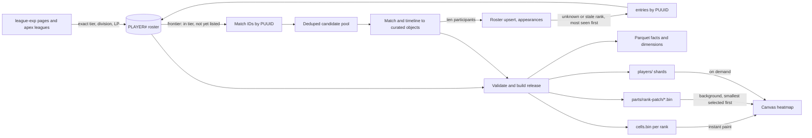

# ProLeague Heatmap

Explore where NA solo queue players from Challenger down to Diamond get kills and die on Summoner’s Rift. Subject, opponent, and match-context filters drive four views: Deaths, Kills, Danger, and Opportunity. Rank is a first-class filter: narrow the map to one cohort of games, or to subjects and opponents of a given rank.

The source is **solo queue**, not professional tournament play. Ranks are the ladder position observed when a player’s games were collected, not at match time, and a game’s rank is the median rank of its known players. Not endorsed by Riot Games.

**Live application:** [https://d2g2939h9izjje.cloudfront.net](https://d2g2939h9izjje.cloudfront.net)

## Run locally

Requires Python 3.12+, Node 22+, and a Riot development API key for collection.

```sh
make setup
# Set RIOT_API_KEY in .env; .env.example shows the supported variables.
make serve
```

Open http://localhost:8000. The application starts empty when no release exists. `make demo` is an alias for this same application and does not generate fixtures.

Each site visit checks collection status first. If a run is active, the page follows it without checking the key or starting another worker. Otherwise it requests a full refresh: the server reserves ownership, validates the Riot key, and starts collection only when the key is valid. Concurrent visits share the active worker. Interrupted requests retry with the same UUID; a page that has already followed or started a run only polls, even after that run finishes. A new visit can start the next refresh.

Full collection refreshes the configured ladder histories and processes the deduplicated universe. Cached, rejected, and failed games do not count as new; eligible games with zero kill events do count. Collection runs in the background with no status of its own in the page: a visitor can do nothing about a run in flight, so the app shows only the published data it already has and picks up a new release when one lands. `make status` and the `/api/status` endpoint report the stage for operators.

The map paints before any row data arrives. A release carries a prerendered copy of the default view per rank (`cells.bin`, about 220 KB per rank), so the first paint and every rank-only selection are answered instantly and exactly. Row data then streams in the background one partition at a time, smallest selected partition first, three at a time; the status line reads "Loaded k of n partitions · m events". Any filter that needs rows (a champion, a player, a zone, a slider) scans the partitions loaded so far, shows a "Preliminary · k of n partitions" badge until the selected ones have landed, and requests any selected partition the automatic policy had skipped. Partitions beyond 64 MiB of unselected data load only on request. A corrupt partition is reported and retried without evicting the others. Player names load in shards of 8,192 only when a name is shown or searched; a shared link resolves its PUUIDs with one small shard each. The previous map stays usable during updates, and an invalid release never replaces it. Advanced filter data remains lazy per partition unless the URL already needs it.

### How a run collects

A full run is **seed → (frontier → collect → rank) × rounds**, and the roster it works from is durable.

- **Seeding** puts every configured tier on the roster with its exact ladder rank. Challenger, Grandmaster and Master come whole from `league-v4`; Diamond and below are paged through `league-exp-v4` per division, about 205 entries a page, up to `seed_pages_per_division` pages. All of NA Diamond+ (about 53k players when measured: 300 Challenger, 700 Grandmaster, 10k Master, 42k+ Diamond) costs about 250 requests. Each division persists its next page, so an interrupted seed resumes where it stopped.
- **The frontier** is the slice of the roster a run lists: players in a configured tier whose rank was observed within `rank_ttl_seconds` and who have not been listed this run, ordered highest tier first, then least recently listed, then a per-run shuffle, capped at `players_per_run`. Apex and Master fit in every run; Diamond rotates through the cap so coverage is even over time.
- **Collecting** lists each frontier player's history, dedupes the IDs against every game ever collected or rejected, and ingests the shuffled pool. Every game **harvests** all ten participants onto the roster with a count of how often they appear, which is how players below the seeded ladder, unranked players, and players who moved between pages become known.
- **Ranking** resolves harvested players with `league-v4/entries/by-puuid`, most-seen first, up to `rank_lookup_budget` per run. A player with no solo-queue entry is recorded as `UNRANKED`, which is an answer: it is excluded from cohort medians and is not asked again before the TTL. Each lookup writes its own roster record, so there is no scratch to resume.
- **Rounds** (`max_rounds`, full mode only) repeat frontier → collect → rank. Round two's frontier is exactly the players round one harvested and resolved into a configured tier: the snowball. It stops when the frontier is empty or `players_per_run` is spent.

Every run is bounded by `request_budget`. When it is spent the run advances the watermarks of fully listed histories, publishes what it has, and pauses as `budget_exhausted`; resuming the run continues against a fresh allotment of the same size. Ranks are observed at crawl time, never at match time. A player's tier and division changes are kept in a bounded history (eight entries), and a release attributes each game to the observation nearest its start.

Discovery is incremental, so a refresh spends its rate limit on games it does not have. Listed match IDs are deduplicated against every game already collected or rejected before they enter the run's pool, and each fully walked history records the end of the window it scanned on its roster record. Later runs bound the next listing with that watermark, so Riot returns only games played since. A history still holding an unaccounted game — interrupted, depth-capped, or awaiting retry — keeps its previous watermark, so no match ID can be skipped. Lowering `start_time_epoch` widens the window and rescans it rather than leaving the older games hidden. With `max_matches_per_patch` set, a game whose patch is already full is settled as `capped` before its timeline is requested; the shuffled pool keeps the kept sample unbiased.

The bounded `smoke` and `small` modes still exist behind the API and the CLI for quick verification; they are simply no longer exposed as buttons. They seed and list one frontier, interleave listing and fetching so the first game lands quickly, and rank at the end. A bounded run that cannot be satisfied from available histories records the shortfall and pauses instead of claiming completion.

Equivalent commands are `make smoke`, `make small`, `make full`, and `make status`. Resume a paused run’s original quota with:

```sh
PYTHONPATH=src .venv/bin/python -m proleague.pipeline --resume RUN_UUID --local
```

`config.yaml` selects routing, the seeded tiers (the lowest listed tier is the floor; lowering it is a config change only), patch/time bounds, the latest-history depth per player, the key kind, and the per-run budgets. Full refresh uses that configured window, not all games ever played. Every sample depends on discovered histories and is not a random sample of all ranked play.

| Key | Default | Meaning |
| --- | --- | --- |
| `tiers` | `[CHALLENGER, GRANDMASTER, MASTER, DIAMOND]` | Seeded from the ladder and walked; the lowest is the floor. |
| `key_kind` | `personal` | `dev`, `personal` (same limits, no 24 h expiry) or `production`; selects the rate windows. |
| `request_budget` | `60000` | Requests per run before pausing as `budget_exhausted` (about 20 h on a dev/personal key). |
| `players_per_run` | `12000` | Histories listed per run; Diamond rotates by least recently listed. |
| `seed_pages_per_division` | `100` | `league-exp` pages per non-apex division; NA Diamond IV and II each exceed 60 pages, 100 covers them. |
| `rank_lookup_budget` | `3000` | Exact per-player rank lookups per run, most-seen unknown players first. |
| `rank_ttl_seconds` | `604800` | A rank older than this is re-observed when budget allows. |
| `max_rounds` | `2` | Frontier → collect → rank rounds per full run. |
| `max_matches_per_patch` | `null` | Complete games kept per patch; `null` lets the release grow without a cap. |

Budget arithmetic on a personal key (100 requests per 2 minutes, about 71k per day), with the ladder sizes measured on 2026-09-14 (NA Challenger 300, Grandmaster 700, Master 10k, Diamond 42k+) and medium-confidence assumptions for the rest: about 1.5 solo games per player per day; about 54 kill rows per game; about 10% of listed games rejected.

| Item | Requests |
| --- | --- |
| Seeding per run (apex tiers plus about 210 Diamond pages and terminators) | about 250 |
| Listing 12k histories | 12k, about 4 h |
| 1k apex players × 100 games, about 20k unique games | 40k, about 14 h |
| Full Diamond+ 100-game backfill, about 420k games | 840k, about 12 days |
| Backfill bounded to the current patch with `start_time_epoch`, about 90k games | about 180k plus listing, about 3 days |
| Steady state per day (seed, listing, about 6.4k new games, up to 3k lookups) | about 29k, 41% of the budget |

Without a cap the row data grows by roughly 21 MB a day; the prerendered cells stay about 1 MB regardless, which is why the cells path and the 64 MiB automatic-load policy carry the default experience.

The local key is loaded from `.env` without overriding an explicitly injected environment variable. Refreshing `.env` works for the next worker. If you exported an old key in your shell, update or unset that override too.

## ETL and retained data


```mermaid
flowchart LR
  Ladder[league-exp pages and apex leagues] -->|exact tier, division, LP| Roster[(PLAYER# roster)]
  Roster -->|frontier: in tier, not yet listed| List[Match IDs by PUUID]
  List --> Pool[Deduped candidate pool]
  Pool --> Ingest[Match and timeline to curated objects]
  Ingest -->|ten participants| Harvest[Roster upsert, appearances]
  Harvest -->|unknown or stale rank, most seen first| Lookup[entries by PUUID]
  Lookup --> Roster
  Roster --> Build[Validate and build release]
  Ingest --> Build
  Build --> Warehouse[Parquet facts and dimensions]
  Build --> Cells[cells.bin per rank]
  Build --> Parts[parts/rank-patch/*.bin]
  Build --> Players[players/ shards]
  Cells -->|instant paint| Browser[Canvas heatmap]
  Parts -->|background, smallest selected first| Browser
  Players -->|on demand| Browser
```

Full ladder, match, and timeline responses exist only in worker memory. The collector transforms each timeline before persistence and retains selected match dimensions, kill/death facts, reconciliation metadata, and retry checkpoints. ETL reduces retained data and makes the intended analytical schema explicit. The tradeoff is that features needing discarded fields require another API fetch; schema changes cannot always be reconstructed from stored data.

A canonical match is stored under `curated/v1/<matchId>/` as `context.json`, `facts.parquet`, validation metadata, and a `complete.json` marker written last. Timeline failures reuse saved context. Completed games are deduplicated by match ID; events use match ID plus source frame/event indices. Incomplete objects are ignored by publication.

The builder checks input hashes, event identities, match counts, participant references, and join cardinality, reading the two objects per match through a bounded thread pool. It attributes a rank to every participant from the roster (the observation nearest the game's start), derives each game's cohort as the lower median of its known, non-unranked participants, and writes relational snapshots for `fact_kill`, `dim_match`, `dim_participant`, and `dim_player`, then immutable browser assets. Release identity covers the input inventory, the format version, the zone map, and a digest of the tier attribution: a re-seeded roster with unchanged tiers reproduces the same id, a tier change on any participant mints a new release. LP, division and observation times are not part of the id, so `dim_participant` and `dim_player` keep the snapshot taken when a release was first built. Conflicting immutable writes fail. Only after successful validation and upload does `data/current.json` point at the release.

### Release format

A release (`manifest.version` 2, format 3) is a directory:

| Path | Contents |
| --- | --- |
| `cells.bin` | Per rank: deaths and kills per 128² cell, distinct games per cell at 128², 64² and 32², zone totals, and rows, kills, death-game and kill-game counts. About 220 KB per rank. |
| `parts/<rank>-<patch>/core.bin`, `extended.bin`, `matches.json` | Row data for one cohort rank and patch, 60 bytes per row (33 core, 27 extended), match keys local to the partition, rows grouped by game. Rank 255 is "Unknown rank". A partition with games but no kills publishes with zero bytes. |
| `players/index.json`, `names-k.json`, `ids-k.json`, `tiers.bin` | Players in PUUID order in shards of 8,192; the index lists each shard's first PUUID for binary search; `tiers.bin` is one byte per player. |
| `regions.json`, `champions.json`, `manifest.json`, `validation.json` | Dictionaries, the manifest, and the reconciliation report (parts, attribution digest, unknown-rank games, roster size). |

Rank ordinals are stable across releases (Challenger 0 … Iron 9, Unranked 10, unknown 255) and appear as `s.tier`, `o.tier` and `c.tier` in share links. The `scripts/verify_bundle.mjs` check asserts that the prerendered cells equal the browser's own row scan for every rank and grid size, which is the contract between the Python builder and the JavaScript engine.

The browser checks Riot provenance in both the pointer and manifest. It retains a previously loaded valid release when a new download fails. Missing, incomplete, rejected, or zero-event data produces honest empty/error states. **Synthetic data is never served or deployed.** Invented test inputs live only in temporary test directories. The previous synthetic web bundle was moved into the ignored `data/quarantine/` directory.

## Heatmap semantics

| View | Meaning |
| --- | --- |
| Deaths | Distribution of deaths whose victim matches the subject and killer matches the opponent filters. |
| Kills | Distribution of kills whose killer matches the subject and victim matches the opponent filters. |
| Danger | Smoothed death share: `(D + 5) / (D + K + 10)`. |
| Opportunity | `1 - Danger`, using the same eligible events. |

Danger and Opportunity are diverging layers: 0.5 stays pinned to the ramp’s midpoint, and the span is stretched to the range actually present, because a real danger ratio rarely leaves 0.4–0.6 and the full 0–1 ramp would render it as one flat grey. The legend prints the resulting endpoints.

The ratio is descriptive, not a causal win probability. When filters include both sides of every champion kill, kills and deaths balance and the unsmoothed ratio is 0.5. Select a meaningful subject cohort to compare its outcomes.

Events are binned where they happened, on the side they happened. Summoner’s Rift is rotationally similar but not symmetric — lane geometry, camps, and brush differ between sides — so blue and red are never folded together. Coordinates normalize the asymmetric map bounds and flip Y once for the canvas. Team gold is blue minus red; lane gold is relative to the matching actor’s lane opponent. Missing values remain missing. Executions have a victim but no champion killer.

Rank semantics: a participant's rank is the roster observation nearest the game's start, made when the player was seeded from the ladder or looked up, not at match time. A game's rank (the Context → Rank filter) is the lower median of its known participants, excluding unranked ones; a game with no known participant is "Unknown rank" and is part of the default view. Subject and Opponent → Rank filter rows by the actor's own rank; "Unknown rank" as an opponent matches executions, which have no killer.

Zone totals come from exact selected events, independent of display grid resolution. Sparse ratio cells are suppressed, and thin slices use coarser grids. **Smooth** applies a separable Gaussian to the death and kill grids before anything is derived from them, so Danger and Opportunity are formed from the smoothed counts rather than by blurring a ratio, which would weight a cell of one event like a cell of fifty. Player selections and shared links use stable PUUID identity, while names are display labels: the in-game Riot ID name leads and its `#tagline` trails it dimmed, kept because a small share of ladder names collide. Advanced columns load lazily before applying filters that need them.

The browser receives aligned typed-array columns with JSON dictionaries instead of parsing full API payloads. Canonical Parquet keeps stable source identities; compact release-specific dictionary indices support the browser’s scan. Champion names and map artwork come from pinned Data Dragon version 16.17.1.

## AWS and Docker

Terraform creates private data/site S3 buckets, CloudFront with origin access control, ECR, a Fargate task definition, DynamoDB run state, CloudWatch logs, an API Gateway HTTP API with a Lambda controller, and Athena/Glue tables. The initial worker is ARM64 with 0.5 vCPU and 2 GiB memory. It runs on demand when an idle site visit passes the Riot key check, or through the collection CLI; there is no scheduled collection.

The deployed API has no sign-in requirement, as intended for this proof of concept. It accepts only predefined modes, throttles requests, remembers request UUIDs, and reserves one active worker. ECS launch parameters and the idempotency token are durable before launch. An uncertain launch retains ownership while being reconciled. Task-stop events and status checks recover abandoned runs without releasing another run’s lock.

| Interface | Contract |
| --- | --- |
| `POST /api/runs` | `{ "mode": "smoke", "requestId": "UUID" }` |
| `GET /api/status` | `{ "run": { "run_id", "mode", "status", "stage", "new_games", "target", "requests_used", "request_budget", "roster_players", "rank_lookups", "round", ... }, "dataset": { "dataset_id", "count" } }` |
| `data/current.json` | `{ "dataset_id", "base", "source_kind": "riot" }` |

The local development server implements the same application API. In AWS, Lambda validates the key before starting Fargate. Missing or rejected credentials return `auth_required` without a task launch. A worker encountering expiry checkpoints, exits, and requires a refreshed key and a new site visit (or CLI trigger). Run statuses are `starting`, `running`, `succeeded`, `paused`, `auth_required`, and `failed`. Stages include `seeding`, `discovering`, `collecting`, `ranking`, `publishing`, and, for a paused run, `budget_exhausted`, `retry_required`, `exhausted`, or `interrupted`.

No Terraform change is required for the rank ladder. Three triggers to act on later, in order of likelihood: raise task memory to 4096 MiB once the state table holds about a million records (a run reads every `MATCH#` and `PLAYER#` record into memory); add a `kind` attribute and a global secondary index once `PLAYER#` scans pass about a million items (the table is pk-only and a prefix scan is a full-table scan); raise the Fargate `stopTimeout` above 120 s once a salvage publish of the whole release takes minutes.

Cutover from a format-1 release: push the image, run `scripts/build_dataset.py` in cloud mode (it publishes a version-2 pointer, and the old page shows "release format is not supported" for a few minutes), then `scripts/aws_deploy.py site`. That order is deliberate: the old JavaScript fails closed on the new pointer, while new JavaScript pointed at an old release would also fail closed.

The Riot key is an SSM SecureString. Terraform handles only its name and ARN. `scripts/aws_key.py` validates the local value and uploads it without printing it; neither Terraform state, the image, the site, nor API responses contain the key.

Riot development keys expire 24 hours after they are issued. A rejected or missing key ends preflight at `auth_required` before any Fargate task starts. To recover, regenerate the key at developer.riotgames.com, put it in `.env`, and run `.venv/bin/python scripts/aws_key.py` to overwrite the SSM SecureString; then revisit the site. `scripts/aws_key.py --check-only` reports whether the local key is still live without touching SSM.

```sh
# Optional local Docker workflow
# On this Mac: Colima plus Docker Compose and buildx are installed.
docker compose up --build preview
# One standalone local collection:
docker compose --profile collect run --rm collector

# AWS deployment: profile default, region us-east-1
.venv/bin/python scripts/aws_deploy.py bootstrap
.venv/bin/python scripts/aws_deploy.py init
.venv/bin/python scripts/aws_deploy.py plan
.venv/bin/python scripts/aws_deploy.py apply
.venv/bin/python scripts/aws_deploy.py image --image-tag build-UNIQUE_TAG
.venv/bin/python scripts/aws_deploy.py apply --image-tag build-UNIQUE_TAG
.venv/bin/python scripts/aws_key.py
.venv/bin/python scripts/aws_deploy.py site
.venv/bin/python scripts/aws_deploy.py status
```

Deployment helpers retain Terraform’s interactive approval unless `--auto-approve` is supplied. ECR tags are immutable: use a new tag for changed code. Site upload uses an extension allowlist including ES modules and excludes local data, dotfiles, and symlinks. Dataset publication belongs exclusively to the worker.

Athena tables use injected `dataset_id` partition projection. Every query must select a release explicitly:

```sql
SELECT count(*) AS games, count(DISTINCT match_id) AS unique_games
FROM proleague_heatmap.dim_match
WHERE dataset_id = 'PUBLISHED_DATASET_ID';

SELECT match_id, frame_index, event_index, count(*) AS copies
FROM proleague_heatmap.fact_kill
WHERE dataset_id = 'PUBLISHED_DATASET_ID'
GROUP BY match_id, frame_index, event_index
HAVING count(*) > 1;

SELECT tier, count(*) AS games
FROM proleague_heatmap.dim_match
WHERE dataset_id = 'PUBLISHED_DATASET_ID'
GROUP BY tier;

SELECT tier, division, count(*) AS players
FROM proleague_heatmap.dim_player
WHERE dataset_id = 'PUBLISHED_DATASET_ID'
GROUP BY tier, division
ORDER BY 1, 2;
```

`dim_player` is the roster at build time (current tier, division, LP, observation time and source); `dim_participant` carries the tier and division attributed to each participant for that game. Old warehouse partitions read the new columns as NULL.

Costs depend on collection duration, request counts, stored releases, and query scans. Fargate and its public IPv4 address are used only while a worker runs; S3, ECR, logs, and other retained resources remain afterward. Logs retain 14 days. The Athena workgroup limits bytes scanned per query. Review `terraform -chdir=infra plan -destroy` before teardown; nonempty buckets/repositories require deliberate cleanup, and the bootstrap state bucket is protected against destruction.

## Agent Toolkit for AWS

The AWS CLI login was verified, the 23 default skills were installed, and the available-skill catalog was queried successfully using the [supplied setup instructions](https://raw.githubusercontent.com/aws/agent-toolkit-for-aws/refs/heads/main/setup-instructions/setup.md). The AWS MCP configuration is installed for Codex with `AWS_MCP_PROXY_PROFILES=default`; project guidance is in `AGENTS.md`, retaining Terraform and Docker as the project requirements.

Restart Codex to load the new MCP connection. The current session uses the AWS CLI fallback. For another AWS account, run `aws login --profile NAME`, add the profile name to the space-separated `AWS_MCP_PROXY_PROFILES` setting, and restart the client. A configured MCP connection is distinct from an observed successful tool call; that connection has not yet been exercised in a restarted session.

## Verification and limitations

```sh
make test     # Python integration/transform/controller tests and production JS module tests
make verify   # Validate the currently published browser release; absence is a failure
```

Current checks: **92 Python tests and 34 JavaScript tests passed**, JavaScript syntax checks passed, and a bounded real-API `small` collection against the Challenger-to-Diamond ladder seeded the roster, collected and ranked, and published a format-3 release that passed the production bundle verifier, including the prerendered-cells-equal-row-scan contract for every rank and grid size; a second `make build` reproduced the same `dataset_id`. The npm commands in `AGENTS.md` are unavailable because this repository has no `package.json`; use `make test`. Earlier deployment checks confirmed Terraform validates, the ARM64 image builds and runs as a non-root user, and the deployed stack is managed from remote Terraform state.

The deployed site still serves the format-1 release `v1-b97d0c7fed80ae1558ec` (300 games) until the cutover described above is run: image, cloud `build_dataset.py`, then `aws_deploy.py site`. No cap on release size exists anywhere in the code unless `max_matches_per_patch` is set: a release is the cumulative union of every game collected so far, and automatic collection is what grows it.

Tests cover bounded then incremental collection, full history refresh, zero-kill games, exhaustion, expiry before/mid-run, manual recovery, timeline retry, local ownership, request replay, interrupted publication, immutable conflicts, ladder seeding with per-division resume, request-budget pauses and resumes, harvest and most-seen-first ranking with `UNRANKED`, rank history and TTL re-observation, frontier caps and rotation, the second-round snowball, the per-patch cap, cohort partitions with as-of attribution, prerendered cells against a recount of the partition rows, sorted player shards, attribution-only dataset ids, stable player links through one ids shard, rank ordinals in share links, cells-first loading with background partition merges, corrupt or oversized partitions failing alone, dataset changes mid-stream, zero-row and single-rank releases, side-independent binning, lane gold per partition, exact zones, provenance and unsupported-format rejection, and incomplete downloads. Test fixtures never populate the serving directory.

Remaining analytical limits: frame-derived economy and nearby-player state can be stale by one timeline frame; respawn and objective timing flags use models; hand-authored region boundaries are approximate. These derived attributes should not be treated as directly observed positions or exact timers. History depth and ladder membership constrain the sample, while blank roles retain unknown values rather than inferred lane comparisons.

All application code, tests, infrastructure, and setup instructions live in this repository. The README is the take-home write-up; `PROJECT_PLAN.html` is a short navigation page for the delivered architecture.
